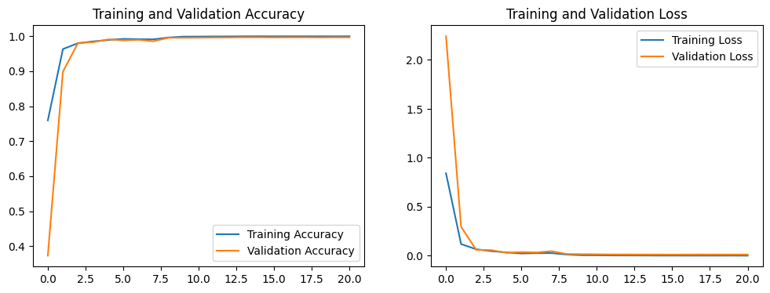
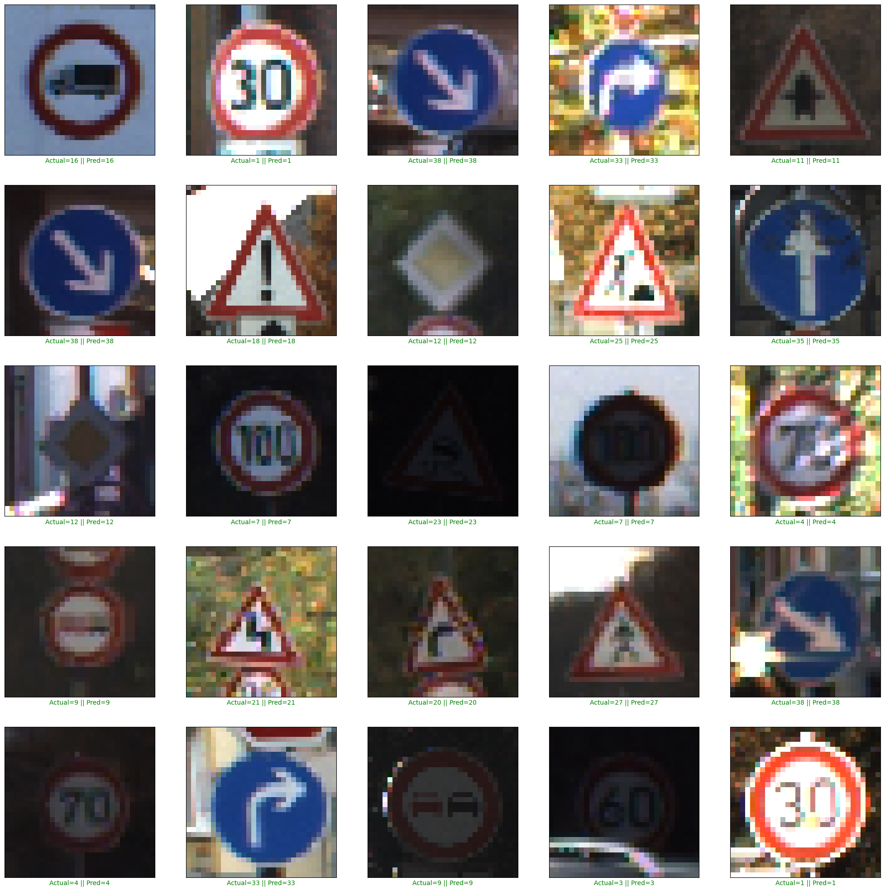

# German Traffic Sign Classification with CNN

This repository contains a Convolutional Neural Network (CNN) model developed to classify images of German traffic signs using the German Traffic Sign dataset. This project demonstrates advanced techniques in deep learning, including image preprocessing, CNN model architecture, and performance evaluation.

## Project Overview

The main objective of this project is to accurately classify images of German traffic signs into 43 different categories. This model can be valuable in applications such as autonomous driving, where recognizing traffic signs is essential for safety. The project is implemented using TensorFlow/Keras for building the CNN model.

## Dataset

- **Source**: [German Traffic Sign Recognition Benchmark (GTSRB)](http://benchmark.ini.rub.de/?section=gtsrb&subsection=dataset)
- **Classes**: 43 distinct classes representing different types of traffic signs.
- **Size**: Approximately 50,000 images for training and testing.
- **Data Split**: The dataset is split into training, validation, and test sets.
- **Augmentation**: Data augmentation techniques (rotation, shifting, zooming, etc.) were applied to improve model generalization.

## Model Architecture

The CNN model is designed with the following layers:
1. **Convolutional Layers**: For extracting features from the images.
2. **Batch Normalization**: To stabilize and speed up the training process.
3. **Pooling Layers**: For dimensionality reduction.
4. **Dropout Layers**: To prevent overfitting by randomly deactivating some neurons.
5. **Fully Connected Layers**: For classification, with a softmax output layer to predict the probabilities for each class.

The model uses the Adam optimizer with a learning rate of 0.001, and categorical cross-entropy is used as the loss function.

## Training

1. **Data Preprocessing**: Images were resized to 30x30 pixels, normalized, and augmented.
2. **Training and Validation**: The model was trained with early stopping and learning rate reduction to prevent overfitting.
3. **Callbacks**:
    - **EarlyStopping**: Monitors the validation loss to stop training when no further improvement is observed.
    - **ReduceLROnPlateau**: Reduces the learning rate when a plateau is detected in the validation loss.
    - **ModelCheckpoint**: Saves the model with the best validation accuracy.

### Model Performance

- **Final Training Accuracy**: ~99.98%
- **Validation Accuracy**: ~99.67%
- **Test Accuracy**: 96.04%
- **Test Loss**: 0.16

### Evaluation

The model achieved an impressive overall accuracy of **96%** on the test set. Below is the classification report and visualizations of the model's performance:

#### Training and Validation Accuracy and Loss

## Sample Predictions

The green labels indicate correct predictions, while red labels show misclassifications.

## Conclusion

This project successfully demonstrates the application of CNNs in image classification, specifically for recognizing German traffic signs. With an accuracy of over 96% on the test set, the model proves to be effective in distinguishing between different traffic sign classes.

## License

This project is licensed under the MIT License - see the LICENSE file for details.